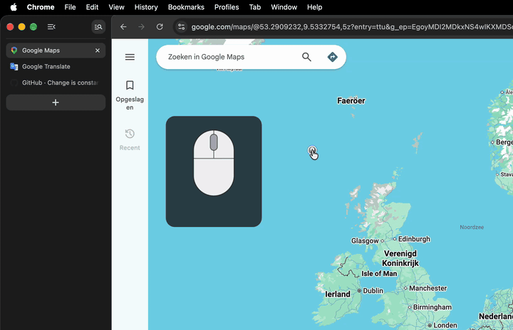
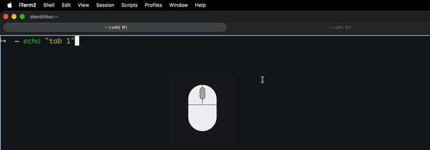
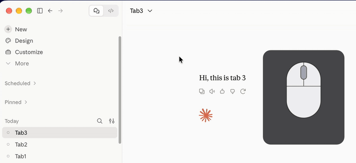
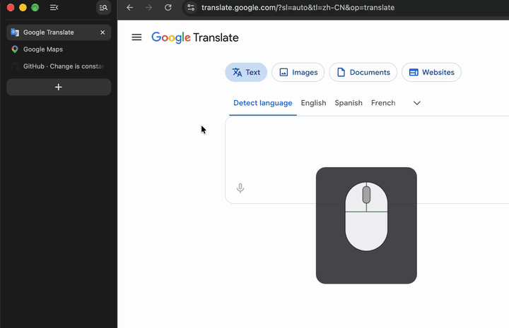
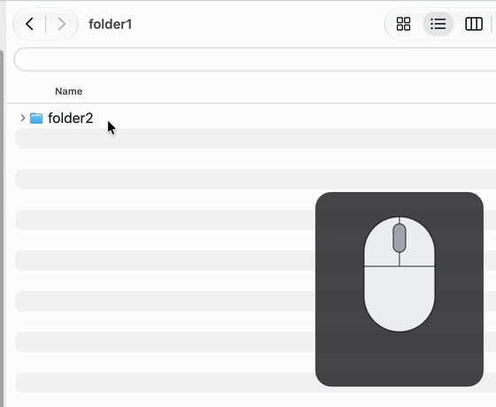

# Squiggle

**The same mouse gestures in every Mac app.** Browser, terminal, Finder, chat
client: one set of right-button gestures that behaves the same everywhere.
Lives in the menu bar.

Hold the right button and turn the wheel to switch tabs. The same gesture in
Chrome, iTerm and Claude:

<table>
  <tr>
    <td width="50%"></td>
    <td width="50%"></td>
  </tr>
  <tr>
    <td align="center">Chrome</td>
    <td align="center">iTerm</td>
  </tr>
  <tr>
    <td></td>
    <td></td>
  </tr>
  <tr>
    <td align="center">Claude</td>
    <td align="center">Drag down, then right: close tab</td>
  </tr>
</table>

In Finder, drag left for the parent folder and right to go back down:

  

Hold the right mouse button and drag. A trail follows the pointer, and once a
direction is recognised a small label shows what will happen.

| Gesture | Action | Sends |
|---|---|---|
| right + drag left | Back | ⌘[ |
| right + drag right | Forward | ⌘] |
| right + drag up | Scroll to top | Home |
| right + drag up, down | Reload | ⌘R |
| right + drag down, right | Close tab | ⌘W |
| right held + wheel up | Previous tab | ⌘⇧[ |
| right held + wheel down | Next tab | ⌘⇧] |
| right click, no movement | normal context menu | — |

Finder gets its own set:

| Gesture | Action |
|---|---|
| right + drag left | parent folder, stopping at `~/` |
| right + drag right | back down into the subfolder you came from |
| right + drag down, right | close window ⌘W |

Every gesture is configurable, globally and per app.

## Install

Download `Squiggle-*.dmg` from Releases, open it, drag Squiggle onto the
Applications folder and launch it. Apple Silicon only.

macOS then asks for **Accessibility** permission, which Squiggle needs to
see and replace right-button events. The menu bar icon shows `◌` while it
waits and turns to `◉` as soon as the permission is granted; no restart
needed. `◎` means gestures are switched off from the menu.

To start at login, add Squiggle under System Settings > General > Login Items.

## License

MIT
